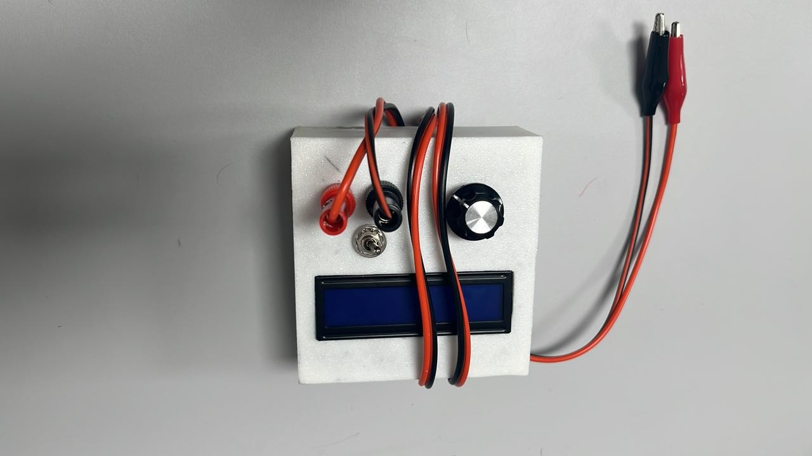
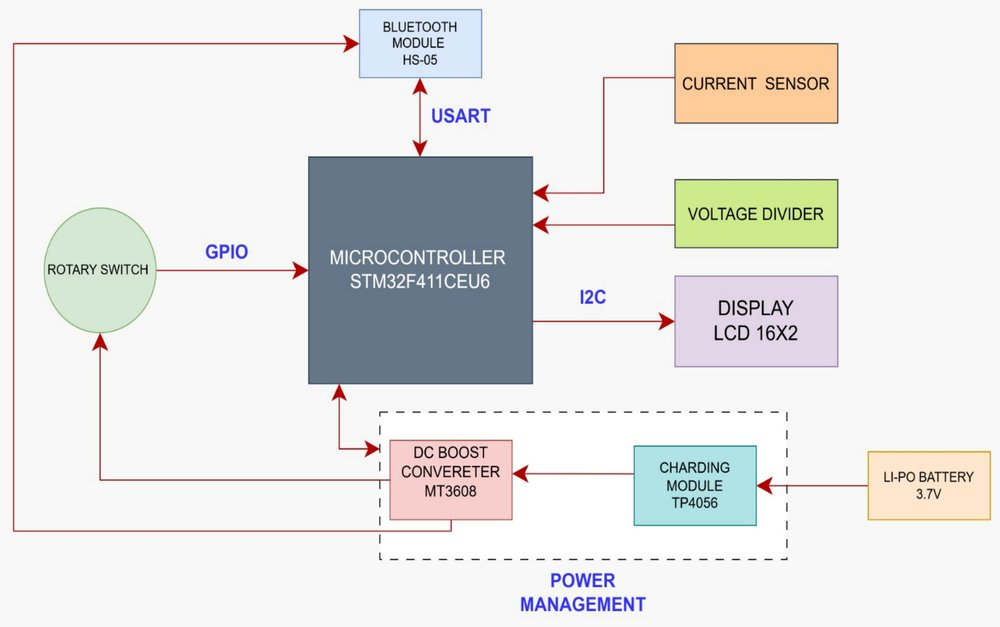
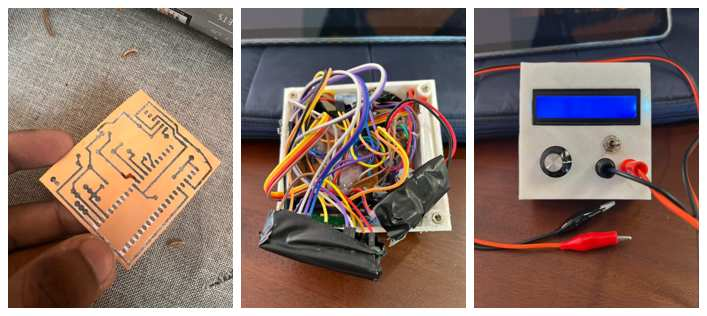
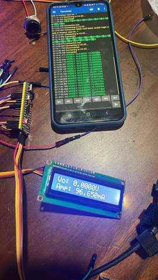
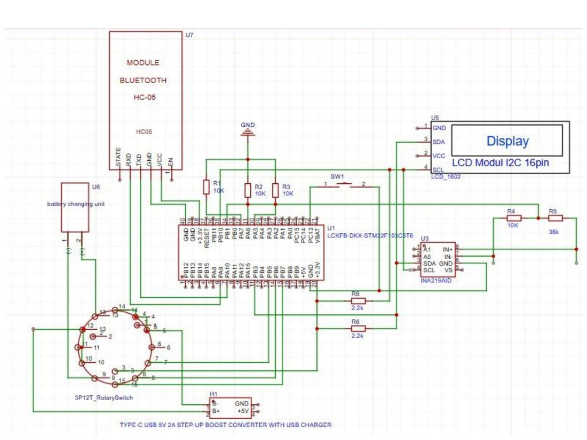

# STM32 Ultra-Precision Voltage & Current Meter

A compact bench instrument built around an STM32F401CEU6. It measures DC voltage
to four decimal places and DC current down to microamp resolution, shows the
active reading on a 16×2 character LCD, and streams it over Bluetooth to a phone
or laptop.



---

## Overview

The instrument combines two independent measurement front ends behind a single
three-button interface.

Voltage is taken by the microcontroller's own 12-bit ADC through a precision
resistive divider, giving a 0–16 V input range displayed to 0.1 mV steps. Current
is measured by an **INA226** high-side monitor across a 0.1 Ω sense resistor,
which the firmware reads over I²C and presents in either milliamp or microamp
scale. A separate slide switch enables a Bluetooth telemetry stream, so readings
can be logged on a phone while the meter sits in the circuit under test.

Everything runs bare-metal on the STM32 HAL — no RTOS, no dynamic allocation. The
display is redrawn only when a digit actually changes, which keeps the I²C bus
quiet and the reading rock-steady instead of flickering between neighbouring
counts.

---

## Project at a glance

| | |
|---|---|
| **Microcontroller** | STM32F401CEU6 (Cortex-M4F, 48-pin "Black Pill") |
| **System clock** | 16 MHz HSI, no PLL, flash latency 0 |
| **Voltage range** | 0 – 16 V DC, displayed as `X.XXXX V` |
| **Voltage front end** | ADC1 channel 9 (PB1), 12-bit, resistive divider 9906 Ω / 39010 Ω |
| **Current sensor** | INA226 on I²C2 @ `0x44`, 0.1 Ω shunt |
| **Current resolution** | 25 µA per LSB (2.5 µV shunt LSB ÷ 0.1 Ω) |
| **Current range** | up to ≈819 mA before register saturation |
| **Display** | HD44780 16×2 LCD over PCF8574 I²C backpack @ `0x27` |
| **Wireless** | HC-05 Bluetooth on USART1, 9600 baud 8N1 |
| **Telemetry rate** | one frame every 5 s while enabled |
| **Toolchain** | STM32CubeIDE / STM32Cube HAL |

---

## Physical controls

| Control | Pin | Behaviour |
|---|---|---|
| **Voltage** button | `PB6` | Selects voltage mode — `X.XXXX V` |
| **Milliamp** button | `PB7` | Selects current mode in mA — `X.XXX mA` |
| **Microamp** button | `PB8` | Selects current mode in µA — `XX.XX uA` |
| **Bluetooth** switch | `PC13` | Slide switch to GND. Closed = streaming on, open = streaming off |

The three mode buttons are active-HIGH with internal pull-downs, and are
debounced in firmware on the rising edge with a 50 ms guard window. Selecting a
mode clears the LCD and invalidates the redraw cache so the new units appear
immediately.

The Bluetooth switch is read as a live level rather than an edge, using the
STM32's internal pull-up: closing the switch pulls `PC13` low and enables the
stream. While the switch is open the interval timer is continuously reset, so
turning it back on always waits a full five seconds before the first frame
instead of releasing a stale queued reading.

In microamp mode any reading above 99 µA is replaced by `OVERLOAD!`, since the
two-digit field cannot represent it honestly.

---

## Architecture



The firmware is a single cooperative loop — there is no scheduler and no
interrupt-driven measurement path. Each pass through the loop performs five
steps in order:

1. **Scan the mode buttons.** Rising edges on `PB6`/`PB7`/`PB8` select the
   display mode; a change clears the LCD and invalidates the value cache.
2. **Sample the ADC.** Sixteen conversions are averaged, the stored zero offset
   is subtracted, and a small dead-band suppresses residual noise around zero.
3. **Read the INA226.** A single 16-bit signed current register read over I²C,
   scaled to both mA and µA.
4. **Update the LCD.** Only the fields whose displayed digits changed are
   rewritten.
5. **Service Bluetooth.** If the switch is on and five seconds have elapsed, the
   active reading is transmitted.

The loop then rests for 500 ms, giving a calm ~2 Hz refresh. The INA226 keeps
converting independently at its own rate throughout, so this delay sets only how
often a result is *presented*, not how often the sensor measures.

---

## Measurement approach

### Voltage — divider, averaging, and a stored zero

The input passes through a resistive divider of **R1 = 9906 Ω** (low side) and
**R2 = 39010 Ω** (high side), scaling a 16 V input down to roughly 3.2 V at the
ADC pin — just under the 3.313 V reference the firmware assumes. The measured
voltage is recovered as:

```
Vin = (adc_corrected / 4095) × 3.313
Vo  = Vin × (9906 + 39010) / 9906
```

Two things lift this above a naive `HAL_ADC_GetValue()` reading:

**Oversampling.** Every displayed value is the mean of 16 back-to-back
conversions. Averaging *N* samples of uncorrelated noise improves the
signal-to-noise ratio by √N, so 16 samples buys roughly a factor of four — the
difference between a last digit that flickers and one that sits still.

**A persistent zero-offset calibration.** On the very first boot the firmware
runs a calibration pass: it prompts `OPEN PROBES` on the LCD, discards 32
warm-up conversions, then averages **512** samples to characterise the ADC's
zero-input offset. That offset is subtracted from every subsequent reading. The
result is stored in a `.noinit` RAM section along with a `0xA55A5AA5` magic
value, so it survives a reset without re-running the routine — the meter only
re-calibrates on a genuine cold start. An implausible offset (≥ 100 counts) is
rejected and treated as zero rather than corrupting every later measurement.

A four-count dead-band finally clamps near-zero readings to exactly zero, so an
idle meter reads `0.0000 V` instead of drifting in the last digit.

### Current — INA226 and the shunt maths

Current measurement is delegated to a dedicated part rather than the STM32's
ADC. The INA226 measures the differential voltage across a **0.1 Ω** sense
resistor with a fixed **2.5 µV** shunt LSB, which sets the current resolution
directly:

```
Current LSB = 2.5 µV / 0.1 Ω = 25 µA per bit
```

The calibration register is programmed so the device's own current register
carries that scale:

```
Cal = 0.00512 / (Current_LSB × R_shunt)
    = 0.00512 / (25e-6 × 0.1)
    = 2048
```

With a signed 16-bit register the full scale is `32767 × 25 µA ≈ 819 mA`,
comfortably inside the 81.92 mV differential limit of the shunt. The device is
configured for a **16-sample hardware average** with 1.1 ms conversion times on
both bus and shunt channels in continuous mode (`CONFIG = 0x4527`), so the
averaging happens in silicon before the STM32 ever reads the register.

The firmware reads the raw register once per loop and scales it twice — by
`0.025` for milliamps and by `25.0` for microamps — so switching display mode
costs nothing but a different multiply.

Note that 25 µA is the honest floor of this configuration. Finer steps would
require a larger sense resistor (≥ 2.5 Ω for 1 µA/bit), which is a direct trade
against burden voltage and dissipation in the measured circuit.

### Display integrity

Both the voltage and current paths split their float into integer and fractional
parts with explicit rounding and a carry check, so a value like `4.99997` is
presented as `5.0000` rather than `4.9999`. Each field is compared against a
cached copy of the last-drawn digits and the LCD is written only on a genuine
change — the panel is silent when the reading is stable.

---

## Repository map

```
ultra-precision-vi-meter/
├── README.md
├── LICENSE
├── docs/
│   ├── HARDWARE.md            Wiring, schematic walkthrough, Bluetooth setup
│   ├── TECHNICAL_OVERVIEW.md  File-by-file firmware reference
│   └── assets/                Photographs and diagrams
└── firmware/
    ├── Display.ioc            STM32CubeMX project definition
    ├── STM32F401CEUX_FLASH.ld Linker script (flash target)
    ├── STM32F401CEUX_RAM.ld   Linker script (RAM target)
    └── Core/
        ├── Inc/
        │   ├── INA226_STM32.h       Current monitor driver interface
        │   ├── liquidcrystal_i2c.h  HD44780 over I²C interface
        │   ├── main.h
        │   ├── stm32f4xx_hal_conf.h HAL module selection
        │   └── stm32f4xx_it.h
        ├── Src/
        │   ├── main.c               Application: modes, ADC, loop, telemetry
        │   ├── INA226_STM32.c       Current monitor driver
        │   ├── liquidcrystal_i2c.c  LCD driver
        │   ├── stm32f4xx_hal_msp.c  Peripheral pin/clock initialisation
        │   ├── stm32f4xx_it.c       Interrupt handlers
        │   ├── system_stm32f4xx.c   CMSIS system startup
        │   ├── syscalls.c
        │   └── sysmem.c
        └── Startup/
            └── startup_stm32f401ceux.s
```

The vendor STM32Cube HAL and CMSIS driver trees are not committed — STM32CubeIDE
regenerates them from `Display.ioc` when the project is opened.

---

## Gallery

**Assembled unit and etched board**



**Bring-up and testing**



**Circuit**



Full annotation of the schematic is in [`docs/HARDWARE.md`](docs/HARDWARE.md).

---

## Building and flashing

1. Open **STM32CubeIDE** and choose *File → Import → Existing Projects into
   Workspace*, pointing at the `firmware/` directory.
2. Open `Display.ioc` once and let CubeMX regenerate the HAL and CMSIS driver
   trees, then *Project → Build All*.
3. Connect an ST-Link to the SWD header and flash with *Run → Debug*, or load the
   produced `.elf` / `.bin` with STM32CubeProgrammer.

On first power-up the meter runs its zero-offset calibration and shows
`CALIBRATING... / OPEN PROBES` — leave the probes unconnected until the splash
screen appears.

## Licence

Released under the MIT Licence. See [`LICENSE`](LICENSE).

The HD44780 I²C driver derives from the widely circulated `liquidcrystal_i2c`
port of the Arduino LiquidCrystal_I2C library. STM32Cube HAL, CMSIS and the
generated startup code remain under their original STMicroelectronics and ARM
licence terms.
